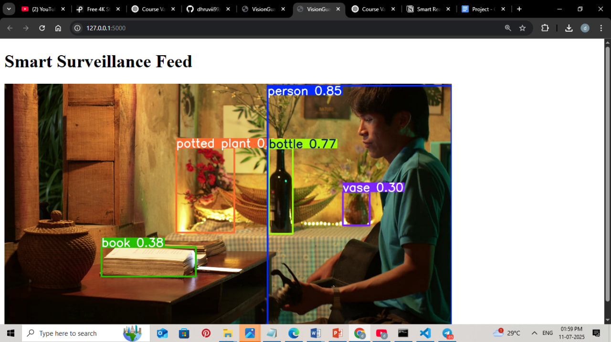

# 🚨 VisionGuard Smart Surveillance

An AI-powered smart surveillance & incident reporting system using **YOLOv8**, **Flask**, **NLP**, and **Twilio** alerts.

---

## 🚀 Features

- 📹 **Live CCTV video feed processing**
- 🎯 **Object detection with YOLOv8**
- 📝 **Automatic detection logs saved in CSV**
- 🌐 **Web dashboard built with Flask**
- 🔔 **Instant alert system** (Twilio integration — planned)
- 📊 **NLP module for smart event reporting** (planned)

---

## 📂 Project Structure
visionguard-smart-surveillance/
├── app.py # Flask app
├── yolo_test.py # YOLO standalone test
├── yolov8n.pt # YOLOv8 model weights
├── videos/ # Input CCTV/sample videos
├── logs/ # Detection logs (CSV)
├── templates/index.html # Web dashboard template
├── requirements.txt # Python dependencies
├── screenshots/ # Project screenshots/demo GIFs
├── .gitignore # Ignore venv, logs, etc.
├── README.md # Project info


---

## 📸 Demo

| CCTV Feed with Object Detection |
|---------------------------------|
|  |

👉 *Demo video/GIF coming soon!*

---

## ⚙️ How to Run Locally

1️⃣ **Clone the repository**
```bash
git clone https://github.com/dhruvii99/visionguard-smart-surveillance.git
cd visionguard-smart-surveillance

# Windows
python -m venv venv
venv\Scripts\activate

# Mac/Linux
python3 -m venv venv
source venv/bin/activate

pip install -r requirements.txt
python yolo_test.py
python app.py

## Open your browser and visit:
http://127.0.0.1:5000
--
✅ Object detection will run on the live feed, and detection logs will be auto-saved as CSV in logs/.

---

## 📞 Twilio Alerts

Twilio integration for real-time SMS alerts is **in progress**.  
Stay tuned!

---

## 💡 NLP Event Reporting

Upcoming: Smart NLP module for better incident description & reporting.

---

## 🤝 Contributing

Pull requests are welcome! For major changes, please open an issue first to discuss what you would like to change.

---

## 📝 License

This project is for **educational/demo purposes only**.


